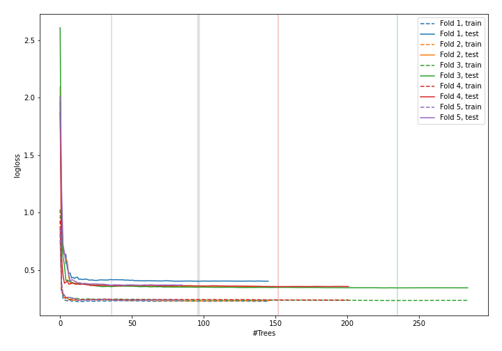
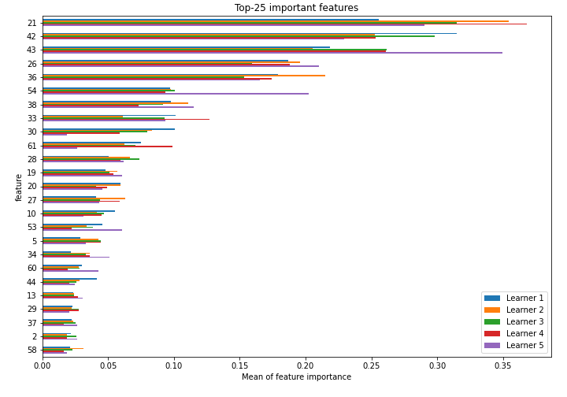
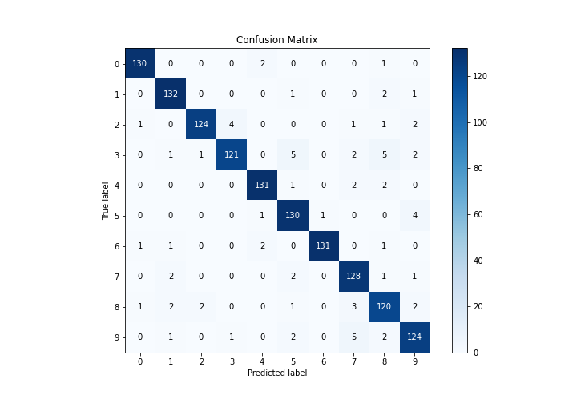
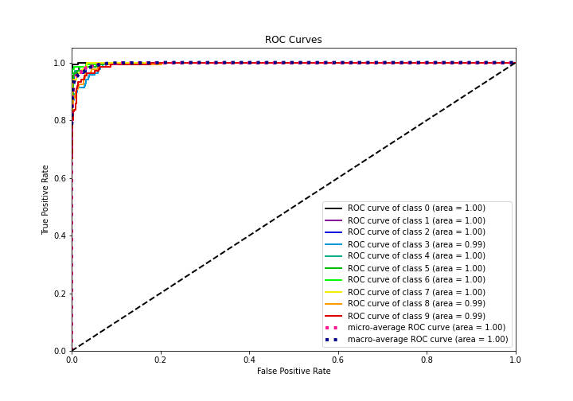
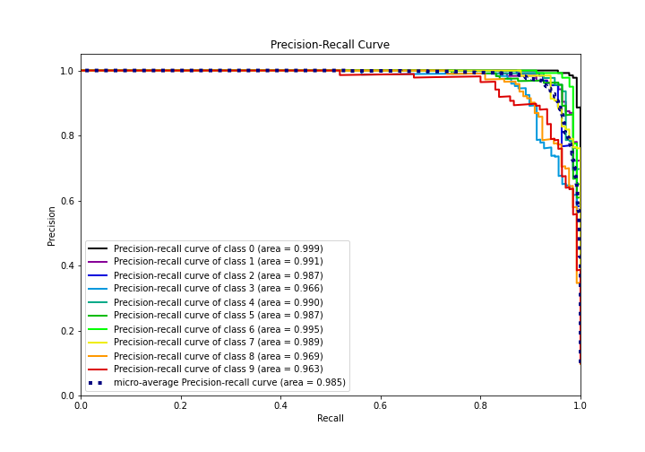

# Summary of 37_RandomForest

[<< Go back](../README.md)

## Random Forest
- **n_jobs**: -1
- **criterion**: entropy
- **max_features**: 0.7
- **min_samples_split**: 20
- **max_depth**: 7
- **eval_metric_name**: logloss
- **num_class**: 10
- **explain_level**: 1

## Validation
 - **validation_type**: kfold
 - **k_folds**: 5
 - **shuffle**: True
 - **stratify**: True

## Optimized metric
logloss

## Training time

33.4 seconds

### Metric details
|           |          0 |          1 |          2 |          3 |          4 |          5 |          6 |          7 |          8 |          9 |   accuracy |   macro avg |   weighted avg |   logloss |
|:----------|-----------:|-----------:|-----------:|-----------:|-----------:|-----------:|-----------:|-----------:|-----------:|-----------:|-----------:|------------:|---------------:|----------:|
| precision |   0.977444 |   0.94964  |   0.976378 |   0.960317 |   0.963235 |   0.915493 |   0.992424 |   0.907801 |   0.888889 |   0.911765 |   0.943578 |    0.944339 |       0.94449  |  0.365933 |
| recall    |   0.977444 |   0.970588 |   0.932331 |   0.883212 |   0.963235 |   0.955882 |   0.963235 |   0.955224 |   0.916031 |   0.918519 |   0.943578 |    0.94357  |       0.943578 |  0.365933 |
| f1-score  |   0.977444 |   0.96     |   0.953846 |   0.920152 |   0.963235 |   0.935252 |   0.977612 |   0.930909 |   0.902256 |   0.915129 |   0.943578 |    0.943583 |       0.943661 |  0.365933 |
| support   | 133        | 136        | 133        | 137        | 136        | 136        | 136        | 134        | 131        | 135        |   0.943578 | 1347        |    1347        |  0.365933 |

## Confusion matrix
|              |   Predicted as 0 |   Predicted as 1 |   Predicted as 2 |   Predicted as 3 |   Predicted as 4 |   Predicted as 5 |   Predicted as 6 |   Predicted as 7 |   Predicted as 8 |   Predicted as 9 |
|:-------------|-----------------:|-----------------:|-----------------:|-----------------:|-----------------:|-----------------:|-----------------:|-----------------:|-----------------:|-----------------:|
| Labeled as 0 |              130 |                0 |                0 |                0 |                2 |                0 |                0 |                0 |                1 |                0 |
| Labeled as 1 |                0 |              132 |                0 |                0 |                0 |                1 |                0 |                0 |                2 |                1 |
| Labeled as 2 |                1 |                0 |              124 |                4 |                0 |                0 |                0 |                1 |                1 |                2 |
| Labeled as 3 |                0 |                1 |                1 |              121 |                0 |                5 |                0 |                2 |                5 |                2 |
| Labeled as 4 |                0 |                0 |                0 |                0 |              131 |                1 |                0 |                2 |                2 |                0 |
| Labeled as 5 |                0 |                0 |                0 |                0 |                1 |              130 |                1 |                0 |                0 |                4 |
| Labeled as 6 |                1 |                1 |                0 |                0 |                2 |                0 |              131 |                0 |                1 |                0 |
| Labeled as 7 |                0 |                2 |                0 |                0 |                0 |                2 |                0 |              128 |                1 |                1 |
| Labeled as 8 |                1 |                2 |                2 |                0 |                0 |                1 |                0 |                3 |              120 |                2 |
| Labeled as 9 |                0 |                1 |                0 |                1 |                0 |                2 |                0 |                5 |                2 |              124 |

## Learning curves

## Permutation-based Importance

## Confusion Matrix

## Normalized Confusion Matrix

## ROC Curve

## Precision Recall Curve

[<< Go back](../README.md)
