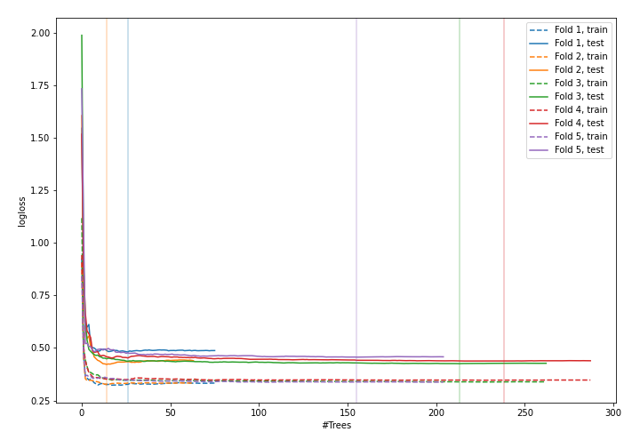
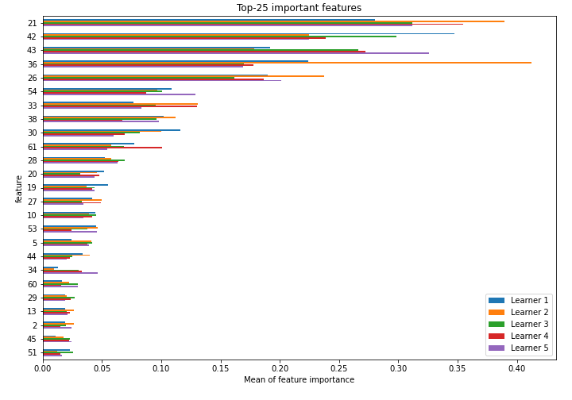
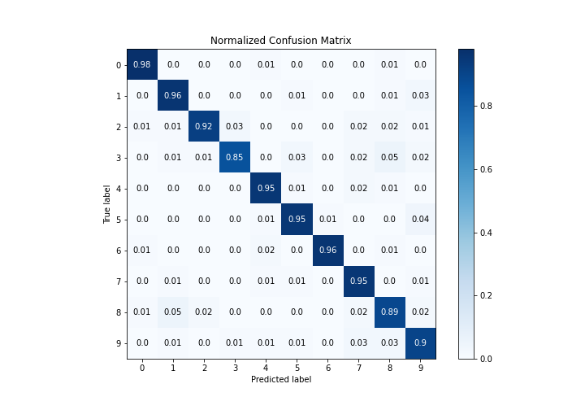
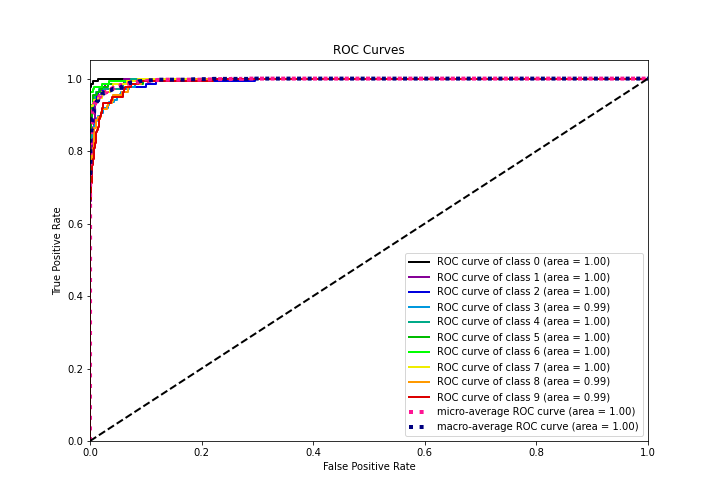
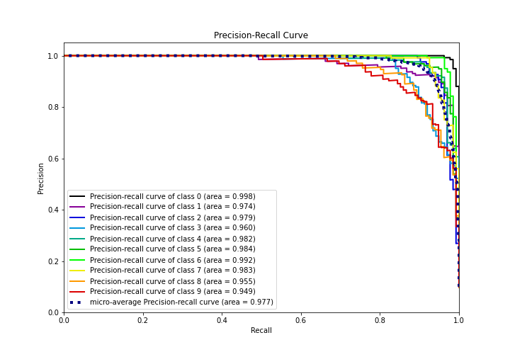

# Summary of 38_RandomForest

[<< Go back](../README.md)

## Random Forest
- **n_jobs**: -1
- **criterion**: entropy
- **max_features**: 0.7
- **min_samples_split**: 40
- **max_depth**: 7
- **eval_metric_name**: logloss
- **num_class**: 10
- **explain_level**: 1

## Validation
 - **validation_type**: kfold
 - **k_folds**: 5
 - **shuffle**: True
 - **stratify**: True

## Optimized metric
logloss

## Training time

41.7 seconds

### Metric details
|           |          0 |          1 |          2 |          3 |          4 |          5 |          6 |          7 |          8 |          9 |   accuracy |   macro avg |   weighted avg |   logloss |
|:----------|-----------:|-----------:|-----------:|-----------:|-----------:|-----------:|-----------:|-----------:|-----------:|-----------:|-----------:|------------:|---------------:|----------:|
| precision |   0.977612 |   0.909091 |   0.968254 |   0.95122  |   0.941606 |   0.921429 |   0.992424 |   0.900709 |   0.865672 |   0.883212 |   0.930215 |    0.931123 |       0.931275 |  0.444465 |
| recall    |   0.984962 |   0.955882 |   0.917293 |   0.854015 |   0.948529 |   0.948529 |   0.963235 |   0.947761 |   0.885496 |   0.896296 |   0.930215 |    0.9302   |       0.930215 |  0.444465 |
| f1-score  |   0.981273 |   0.9319   |   0.942085 |   0.9      |   0.945055 |   0.934783 |   0.977612 |   0.923636 |   0.875472 |   0.889706 |   0.930215 |    0.930152 |       0.930232 |  0.444465 |
| support   | 133        | 136        | 133        | 137        | 136        | 136        | 136        | 134        | 131        | 135        |   0.930215 | 1347        |    1347        |  0.444465 |

## Confusion matrix
|              |   Predicted as 0 |   Predicted as 1 |   Predicted as 2 |   Predicted as 3 |   Predicted as 4 |   Predicted as 5 |   Predicted as 6 |   Predicted as 7 |   Predicted as 8 |   Predicted as 9 |
|:-------------|-----------------:|-----------------:|-----------------:|-----------------:|-----------------:|-----------------:|-----------------:|-----------------:|-----------------:|-----------------:|
| Labeled as 0 |              131 |                0 |                0 |                0 |                1 |                0 |                0 |                0 |                1 |                0 |
| Labeled as 1 |                0 |              130 |                0 |                0 |                0 |                1 |                0 |                0 |                1 |                4 |
| Labeled as 2 |                1 |                1 |              122 |                4 |                0 |                0 |                0 |                2 |                2 |                1 |
| Labeled as 3 |                0 |                2 |                1 |              117 |                0 |                4 |                0 |                3 |                7 |                3 |
| Labeled as 4 |                0 |                0 |                0 |                0 |              129 |                2 |                0 |                3 |                2 |                0 |
| Labeled as 5 |                0 |                0 |                0 |                0 |                1 |              129 |                1 |                0 |                0 |                5 |
| Labeled as 6 |                1 |                0 |                0 |                0 |                3 |                0 |              131 |                0 |                1 |                0 |
| Labeled as 7 |                0 |                2 |                0 |                0 |                2 |                2 |                0 |              127 |                0 |                1 |
| Labeled as 8 |                1 |                7 |                3 |                0 |                0 |                0 |                0 |                2 |              116 |                2 |
| Labeled as 9 |                0 |                1 |                0 |                2 |                1 |                2 |                0 |                4 |                4 |              121 |

## Learning curves

## Permutation-based Importance

## Confusion Matrix

## Normalized Confusion Matrix

## ROC Curve

## Precision Recall Curve

[<< Go back](../README.md)
