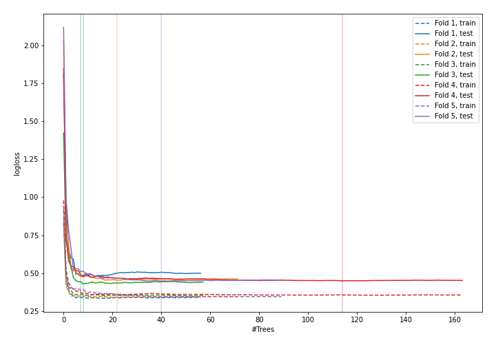
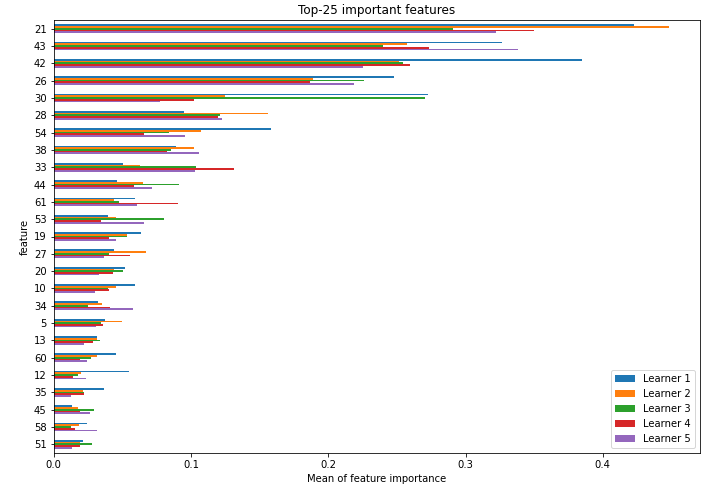
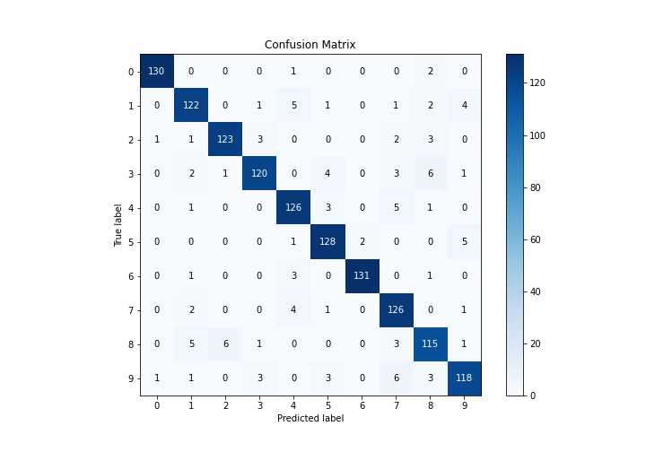
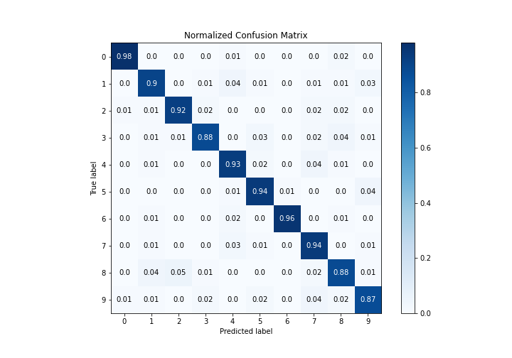
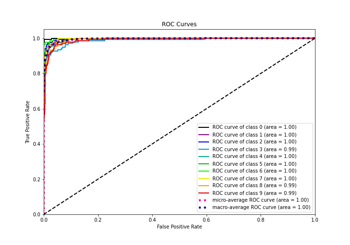
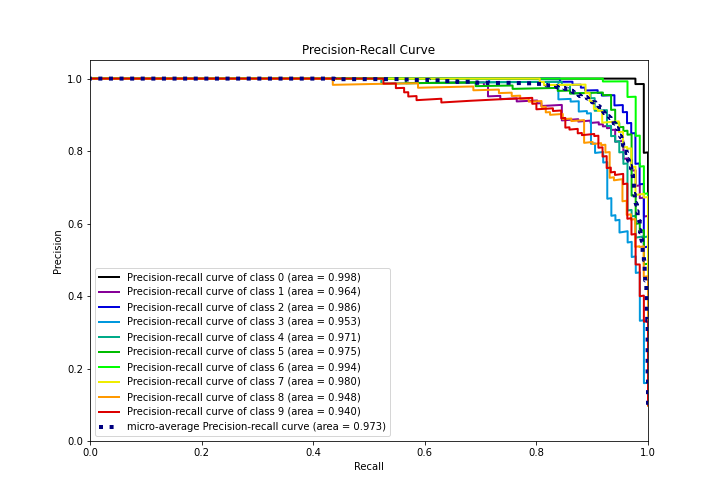

# Summary of 40_RandomForest_SelectedFeatures

[<< Go back](../README.md)

## Random Forest
- **n_jobs**: -1
- **criterion**: entropy
- **max_features**: 0.7
- **min_samples_split**: 40
- **max_depth**: 7
- **eval_metric_name**: logloss
- **num_class**: 10
- **explain_level**: 1

## Validation
 - **validation_type**: kfold
 - **k_folds**: 5
 - **shuffle**: True
 - **stratify**: True

## Optimized metric
logloss

## Training time

18.2 seconds

### Metric details
|           |          0 |          1 |          2 |          3 |          4 |          5 |          6 |          7 |          8 |          9 |   accuracy |   macro avg |   weighted avg |   logloss |
|:----------|-----------:|-----------:|-----------:|-----------:|-----------:|-----------:|-----------:|-----------:|-----------:|-----------:|-----------:|------------:|---------------:|----------:|
| precision |   0.984848 |   0.903704 |   0.946154 |   0.9375   |   0.9      |   0.914286 |   0.984962 |   0.863014 |   0.864662 |   0.907692 |   0.919822 |    0.920682 |       0.920798 |  0.450868 |
| recall    |   0.977444 |   0.897059 |   0.924812 |   0.875912 |   0.926471 |   0.941176 |   0.963235 |   0.940299 |   0.877863 |   0.874074 |   0.919822 |    0.919834 |       0.919822 |  0.450868 |
| f1-score  |   0.981132 |   0.900369 |   0.935361 |   0.90566  |   0.913043 |   0.927536 |   0.973978 |   0.9      |   0.871212 |   0.890566 |   0.919822 |    0.919886 |       0.919936 |  0.450868 |
| support   | 133        | 136        | 133        | 137        | 136        | 136        | 136        | 134        | 131        | 135        |   0.919822 | 1347        |    1347        |  0.450868 |

## Confusion matrix
|              |   Predicted as 0 |   Predicted as 1 |   Predicted as 2 |   Predicted as 3 |   Predicted as 4 |   Predicted as 5 |   Predicted as 6 |   Predicted as 7 |   Predicted as 8 |   Predicted as 9 |
|:-------------|-----------------:|-----------------:|-----------------:|-----------------:|-----------------:|-----------------:|-----------------:|-----------------:|-----------------:|-----------------:|
| Labeled as 0 |              130 |                0 |                0 |                0 |                1 |                0 |                0 |                0 |                2 |                0 |
| Labeled as 1 |                0 |              122 |                0 |                1 |                5 |                1 |                0 |                1 |                2 |                4 |
| Labeled as 2 |                1 |                1 |              123 |                3 |                0 |                0 |                0 |                2 |                3 |                0 |
| Labeled as 3 |                0 |                2 |                1 |              120 |                0 |                4 |                0 |                3 |                6 |                1 |
| Labeled as 4 |                0 |                1 |                0 |                0 |              126 |                3 |                0 |                5 |                1 |                0 |
| Labeled as 5 |                0 |                0 |                0 |                0 |                1 |              128 |                2 |                0 |                0 |                5 |
| Labeled as 6 |                0 |                1 |                0 |                0 |                3 |                0 |              131 |                0 |                1 |                0 |
| Labeled as 7 |                0 |                2 |                0 |                0 |                4 |                1 |                0 |              126 |                0 |                1 |
| Labeled as 8 |                0 |                5 |                6 |                1 |                0 |                0 |                0 |                3 |              115 |                1 |
| Labeled as 9 |                1 |                1 |                0 |                3 |                0 |                3 |                0 |                6 |                3 |              118 |

## Learning curves

## Permutation-based Importance

## Confusion Matrix

## Normalized Confusion Matrix

## ROC Curve

## Precision Recall Curve

[<< Go back](../README.md)
