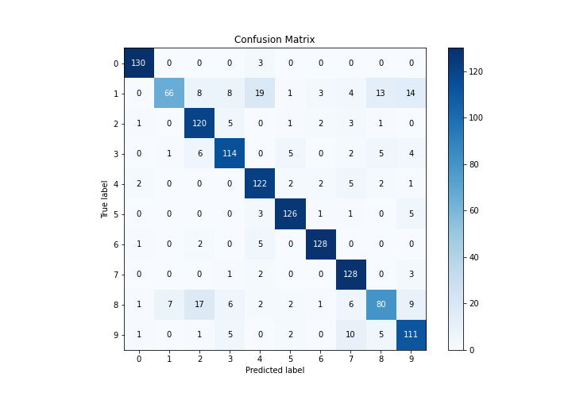

# Summary of 5_Default_RandomForest

[<< Go back](../README.md)

## Random Forest
- **n_jobs**: -1
- **criterion**: gini
- **max_features**: 0.9
- **min_samples_split**: 30
- **max_depth**: 4
- **eval_metric_name**: logloss
- **num_class**: 10
- **explain_level**: 1

## Validation
 - **validation_type**: kfold
 - **k_folds**: 5
 - **shuffle**: True
 - **stratify**: True

## Optimized metric
logloss

## Training time

17.7 seconds

### Metric details
|           |          0 |          1 |          2 |          3 |          4 |          5 |          6 |          7 |          8 |          9 |   accuracy |   macro avg |   weighted avg |   logloss |
|:----------|-----------:|-----------:|-----------:|-----------:|-----------:|-----------:|-----------:|-----------:|-----------:|-----------:|-----------:|------------:|---------------:|----------:|
| precision |   0.955882 |   0.891892 |   0.779221 |   0.820144 |   0.782051 |   0.906475 |   0.934307 |   0.805031 |   0.754717 |   0.755102 |   0.835189 |    0.838482 |       0.838762 |  0.835827 |
| recall    |   0.977444 |   0.485294 |   0.902256 |   0.832117 |   0.897059 |   0.926471 |   0.941176 |   0.955224 |   0.610687 |   0.822222 |   0.835189 |    0.834995 |       0.835189 |  0.835827 |
| f1-score  |   0.966543 |   0.628571 |   0.836237 |   0.826087 |   0.835616 |   0.916364 |   0.937729 |   0.87372  |   0.675105 |   0.787234 |   0.835189 |    0.828321 |       0.828525 |  0.835827 |
| support   | 133        | 136        | 133        | 137        | 136        | 136        | 136        | 134        | 131        | 135        |   0.835189 | 1347        |    1347        |  0.835827 |

## Confusion matrix
|              |   Predicted as 0 |   Predicted as 1 |   Predicted as 2 |   Predicted as 3 |   Predicted as 4 |   Predicted as 5 |   Predicted as 6 |   Predicted as 7 |   Predicted as 8 |   Predicted as 9 |
|:-------------|-----------------:|-----------------:|-----------------:|-----------------:|-----------------:|-----------------:|-----------------:|-----------------:|-----------------:|-----------------:|
| Labeled as 0 |              130 |                0 |                0 |                0 |                3 |                0 |                0 |                0 |                0 |                0 |
| Labeled as 1 |                0 |               66 |                8 |                8 |               19 |                1 |                3 |                4 |               13 |               14 |
| Labeled as 2 |                1 |                0 |              120 |                5 |                0 |                1 |                2 |                3 |                1 |                0 |
| Labeled as 3 |                0 |                1 |                6 |              114 |                0 |                5 |                0 |                2 |                5 |                4 |
| Labeled as 4 |                2 |                0 |                0 |                0 |              122 |                2 |                2 |                5 |                2 |                1 |
| Labeled as 5 |                0 |                0 |                0 |                0 |                3 |              126 |                1 |                1 |                0 |                5 |
| Labeled as 6 |                1 |                0 |                2 |                0 |                5 |                0 |              128 |                0 |                0 |                0 |
| Labeled as 7 |                0 |                0 |                0 |                1 |                2 |                0 |                0 |              128 |                0 |                3 |
| Labeled as 8 |                1 |                7 |               17 |                6 |                2 |                2 |                1 |                6 |               80 |                9 |
| Labeled as 9 |                1 |                0 |                1 |                5 |                0 |                2 |                0 |               10 |                5 |              111 |

## Learning curves

## Permutation-based Importance

## Confusion Matrix

## Normalized Confusion Matrix

## ROC Curve

## Precision Recall Curve

[<< Go back](../README.md)
