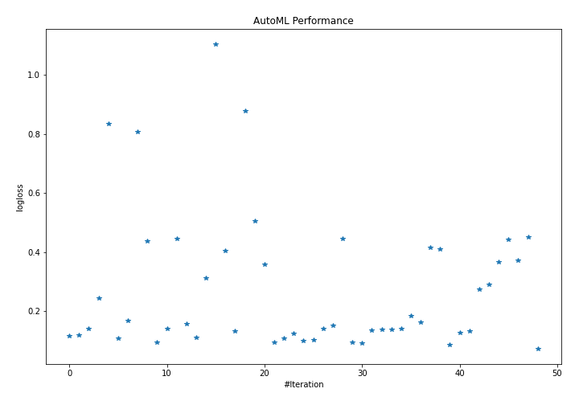
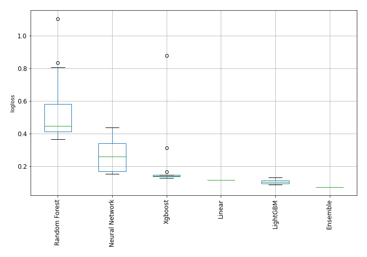
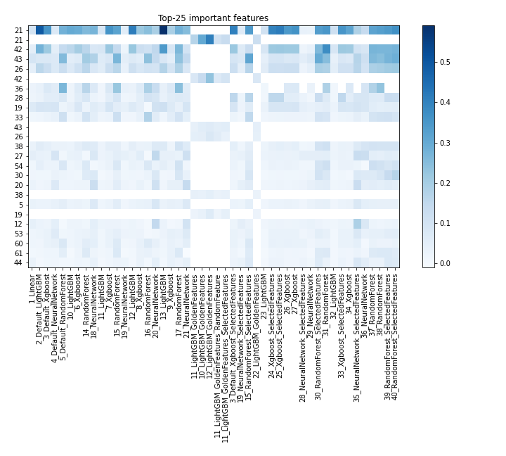
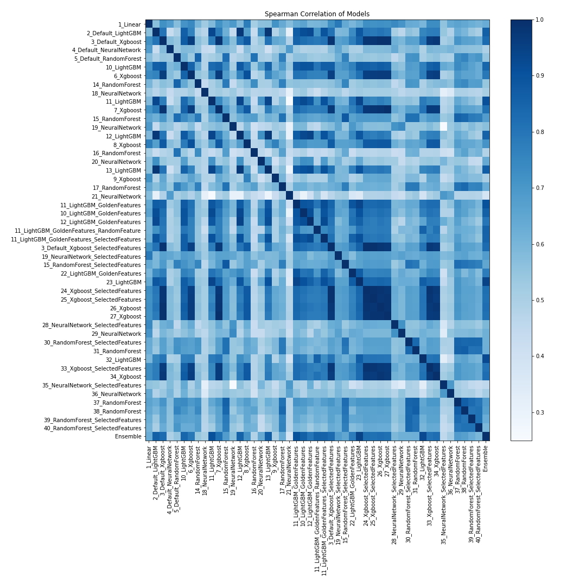

# AutoML Leaderboard

| Best model   | name                                                                                                 | model_type     | metric_type   |   metric_value |   train_time |   single_prediction_time |
|:-------------|:-----------------------------------------------------------------------------------------------------|:---------------|:--------------|---------------:|-------------:|-------------------------:|
|              | [1_Linear](1_Linear/README.md)                                                                       | Linear         | logloss       |      0.11709   |        15.69 |                   0.0624 |
|              | [2_Default_LightGBM](2_Default_LightGBM/README.md)                                                   | LightGBM       | logloss       |      0.119508  |       123.42 |                   0.1152 |
|              | [3_Default_Xgboost](3_Default_Xgboost/README.md)                                                     | Xgboost        | logloss       |      0.141544  |        56.03 |                   0.1132 |
|              | [4_Default_NeuralNetwork](4_Default_NeuralNetwork/README.md)                                         | Neural Network | logloss       |      0.244656  |         4.96 |                   0.0588 |
|              | [5_Default_RandomForest](5_Default_RandomForest/README.md)                                           | Random Forest  | logloss       |      0.835827  |        18.59 |                   0.1127 |
|              | [10_LightGBM](10_LightGBM/README.md)                                                                 | LightGBM       | logloss       |      0.108165  |        52.42 |                   0.1262 |
|              | [6_Xgboost](6_Xgboost/README.md)                                                                     | Xgboost        | logloss       |      0.167262  |        79.17 |                   0.1137 |
|              | [14_RandomForest](14_RandomForest/README.md)                                                         | Random Forest  | logloss       |      0.807765  |        14.19 |                   0.1012 |
|              | [18_NeuralNetwork](18_NeuralNetwork/README.md)                                                       | Neural Network | logloss       |      0.438477  |         5.68 |                   0.0579 |
|              | [11_LightGBM](11_LightGBM/README.md)                                                                 | LightGBM       | logloss       |      0.0942313 |        43.85 |                   0.1327 |
|              | [7_Xgboost](7_Xgboost/README.md)                                                                     | Xgboost        | logloss       |      0.141853  |        64.28 |                   0.1257 |
|              | [15_RandomForest](15_RandomForest/README.md)                                                         | Random Forest  | logloss       |      0.447175  |        24.78 |                   0.1353 |
|              | [19_NeuralNetwork](19_NeuralNetwork/README.md)                                                       | Neural Network | logloss       |      0.15857   |         7.26 |                   0.0578 |
|              | [12_LightGBM](12_LightGBM/README.md)                                                                 | LightGBM       | logloss       |      0.112702  |       102.7  |                   0.1092 |
|              | [8_Xgboost](8_Xgboost/README.md)                                                                     | Xgboost        | logloss       |      0.312174  |        52.93 |                   0.1132 |
|              | [16_RandomForest](16_RandomForest/README.md)                                                         | Random Forest  | logloss       |      1.10438   |         8.86 |                   0.0806 |
|              | [20_NeuralNetwork](20_NeuralNetwork/README.md)                                                       | Neural Network | logloss       |      0.404874  |         5.96 |                   0.0597 |
|              | [13_LightGBM](13_LightGBM/README.md)                                                                 | LightGBM       | logloss       |      0.132     |       150.67 |                   0.1457 |
|              | [9_Xgboost](9_Xgboost/README.md)                                                                     | Xgboost        | logloss       |      0.877835  |        52.04 |                   0.1052 |
|              | [17_RandomForest](17_RandomForest/README.md)                                                         | Random Forest  | logloss       |      0.505358  |        15.81 |                   0.1064 |
|              | [21_NeuralNetwork](21_NeuralNetwork/README.md)                                                       | Neural Network | logloss       |      0.358369  |         6.09 |                   0.0594 |
|              | [11_LightGBM_GoldenFeatures](11_LightGBM_GoldenFeatures/README.md)                                   | LightGBM       | logloss       |      0.0939664 |        41.67 |                   0.1656 |
|              | [10_LightGBM_GoldenFeatures](10_LightGBM_GoldenFeatures/README.md)                                   | LightGBM       | logloss       |      0.108449  |        67.57 |                   0.1726 |
|              | [12_LightGBM_GoldenFeatures](12_LightGBM_GoldenFeatures/README.md)                                   | LightGBM       | logloss       |      0.124281  |       103.06 |                   0.1531 |
|              | [11_LightGBM_GoldenFeatures_RandomFeature](11_LightGBM_GoldenFeatures_RandomFeature/README.md)       | LightGBM       | logloss       |      0.101164  |        36.52 |                   0.1571 |
|              | [11_LightGBM_GoldenFeatures_SelectedFeatures](11_LightGBM_GoldenFeatures_SelectedFeatures/README.md) | LightGBM       | logloss       |      0.103646  |        29.87 |                   0.1352 |
|              | [3_Default_Xgboost_SelectedFeatures](3_Default_Xgboost_SelectedFeatures/README.md)                   | Xgboost        | logloss       |      0.141114  |        62.3  |                   0.0972 |
|              | [19_NeuralNetwork_SelectedFeatures](19_NeuralNetwork_SelectedFeatures/README.md)                     | Neural Network | logloss       |      0.153551  |         6.4  |                   0.0544 |
|              | [15_RandomForest_SelectedFeatures](15_RandomForest_SelectedFeatures/README.md)                       | Random Forest  | logloss       |      0.44574   |        14.34 |                   0.1056 |
|              | [22_LightGBM_GoldenFeatures](22_LightGBM_GoldenFeatures/README.md)                                   | LightGBM       | logloss       |      0.0962352 |        64.85 |                   0.1526 |
|              | [23_LightGBM](23_LightGBM/README.md)                                                                 | LightGBM       | logloss       |      0.0935454 |        61.74 |                   0.1147 |
|              | [24_Xgboost_SelectedFeatures](24_Xgboost_SelectedFeatures/README.md)                                 | Xgboost        | logloss       |      0.136842  |        62.9  |                   0.1023 |
|              | [25_Xgboost_SelectedFeatures](25_Xgboost_SelectedFeatures/README.md)                                 | Xgboost        | logloss       |      0.139399  |        74.47 |                   0.1012 |
|              | [26_Xgboost](26_Xgboost/README.md)                                                                   | Xgboost        | logloss       |      0.138523  |        90.69 |                   0.1102 |
|              | [27_Xgboost](27_Xgboost/README.md)                                                                   | Xgboost        | logloss       |      0.141792  |        77.4  |                   0.1082 |
|              | [28_NeuralNetwork_SelectedFeatures](28_NeuralNetwork_SelectedFeatures/README.md)                     | Neural Network | logloss       |      0.18616   |         6.4  |                   0.0554 |
|              | [29_NeuralNetwork](29_NeuralNetwork/README.md)                                                       | Neural Network | logloss       |      0.164307  |         7.25 |                   0.0594 |
|              | [30_RandomForest_SelectedFeatures](30_RandomForest_SelectedFeatures/README.md)                       | Random Forest  | logloss       |      0.414753  |        15.3  |                   0.0987 |
|              | [31_RandomForest](31_RandomForest/README.md)                                                         | Random Forest  | logloss       |      0.409467  |        25.37 |                   0.1497 |
| **the best** | [32_LightGBM](32_LightGBM/README.md)                                                                 | LightGBM       | logloss       |      0.0869372 |       114.2  |                   0.1302 |
|              | [33_Xgboost_SelectedFeatures](33_Xgboost_SelectedFeatures/README.md)                                 | Xgboost        | logloss       |      0.128594  |        75.16 |                   0.1052 |
|              | [34_Xgboost](34_Xgboost/README.md)                                                                   | Xgboost        | logloss       |      0.13254   |       104.54 |                   0.1382 |
|              | [35_NeuralNetwork_SelectedFeatures](35_NeuralNetwork_SelectedFeatures/README.md)                     | Neural Network | logloss       |      0.274012  |         9.22 |                   0.0685 |
|              | [36_NeuralNetwork](36_NeuralNetwork/README.md)                                                       | Neural Network | logloss       |      0.291446  |        10.3  |                   0.0614 |
|              | [37_RandomForest](37_RandomForest/README.md)                                                         | Random Forest  | logloss       |      0.365933  |        34.43 |                   0.1597 |
|              | [38_RandomForest](38_RandomForest/README.md)                                                         | Random Forest  | logloss       |      0.444465  |        42.68 |                   0.1666 |
|              | [39_RandomForest_SelectedFeatures](39_RandomForest_SelectedFeatures/README.md)                       | Random Forest  | logloss       |      0.372102  |        20.66 |                   0.1192 |
|              | [40_RandomForest_SelectedFeatures](40_RandomForest_SelectedFeatures/README.md)                       | Random Forest  | logloss       |      0.450868  |        19.66 |                   0.1103 |
|              | [Ensemble](Ensemble/README.md)                                                                       | Ensemble       | logloss       |      0.0732018 |         1.38 |                   0.5447 |

### AutoML Performance

### AutoML Performance Boxplot

### Features Importance

### Spearman Correlation of Models

