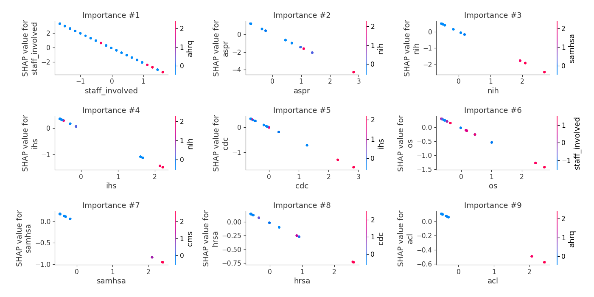
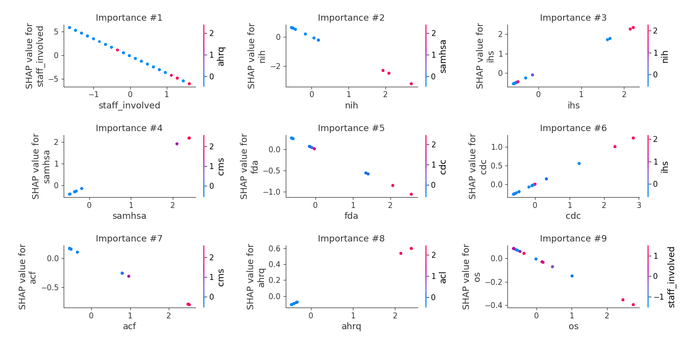

# Summary of 3_Linear

[<< Go back](../README.md)

## Logistic Regression (Linear)
- **n_jobs**: -1
- **num_class**: 19
- **explain_level**: 2

## Validation
 - **validation_type**: split
 - **train_ratio**: 0.75
 - **shuffle**: True
 - **stratify**: True

## Optimized metric
logloss

## Training time

20.6 seconds

### Metric details
|           |      0.0 |   0.18 |   0.27 |     0.55 |   32.0 |   75.0 |   80.0 |   115.0 |   137.0 |   337.0 |   643.0 |   1798.0 |   2151.0 |   2303.0 |   2515.0 |   3842.0 |   7693.0 |   11899.0 |   14050.0 |   accuracy |   macro avg |   weighted avg |   logloss |
|:----------|---------:|-------:|-------:|---------:|-------:|-------:|-------:|--------:|--------:|--------:|--------:|---------:|---------:|---------:|---------:|---------:|---------:|----------:|----------:|-----------:|------------:|---------------:|----------:|
| precision | 0.5      |      0 |      0 | 0.5      |      1 |      1 |      1 |       0 |       1 |       1 |       1 |        1 |        1 |        1 |        1 |        1 |        1 |         1 |         1 |   0.842105 |    0.789474 |       0.789474 |  0.676942 |
| recall    | 1        |      0 |      0 | 1        |      1 |      1 |      1 |       0 |       1 |       1 |       1 |        1 |        1 |        1 |        1 |        1 |        1 |         1 |         1 |   0.842105 |    0.842105 |       0.842105 |  0.676942 |
| f1-score  | 0.666667 |      0 |      0 | 0.666667 |      1 |      1 |      1 |       0 |       1 |       1 |       1 |        1 |        1 |        1 |        1 |        1 |        1 |         1 |         1 |   0.842105 |    0.807018 |       0.807018 |  0.676942 |
| support   | 5        |      5 |      5 | 5        |      5 |      5 |      5 |       5 |       5 |       5 |       5 |        5 |        5 |        5 |        5 |        5 |        5 |         5 |         5 |   0.842105 |   95        |      95        |  0.676942 |

## Confusion matrix
|                    |   Predicted as 0.0 |   Predicted as 0.18 |   Predicted as 0.27 |   Predicted as 0.55 |   Predicted as 32.0 |   Predicted as 75.0 |   Predicted as 80.0 |   Predicted as 115.0 |   Predicted as 137.0 |   Predicted as 337.0 |   Predicted as 643.0 |   Predicted as 1798.0 |   Predicted as 2151.0 |   Predicted as 2303.0 |   Predicted as 2515.0 |   Predicted as 3842.0 |   Predicted as 7693.0 |   Predicted as 11899.0 |   Predicted as 14050.0 |
|:-------------------|-------------------:|--------------------:|--------------------:|--------------------:|--------------------:|--------------------:|--------------------:|---------------------:|---------------------:|---------------------:|---------------------:|----------------------:|----------------------:|----------------------:|----------------------:|----------------------:|----------------------:|-----------------------:|-----------------------:|
| Labeled as 0.0     |                  5 |                   0 |                   0 |                   0 |                   0 |                   0 |                   0 |                    0 |                    0 |                    0 |                    0 |                     0 |                     0 |                     0 |                     0 |                     0 |                     0 |                      0 |                      0 |
| Labeled as 0.18    |                  0 |                   0 |                   0 |                   5 |                   0 |                   0 |                   0 |                    0 |                    0 |                    0 |                    0 |                     0 |                     0 |                     0 |                     0 |                     0 |                     0 |                      0 |                      0 |
| Labeled as 0.27    |                  0 |                   5 |                   0 |                   0 |                   0 |                   0 |                   0 |                    0 |                    0 |                    0 |                    0 |                     0 |                     0 |                     0 |                     0 |                     0 |                     0 |                      0 |                      0 |
| Labeled as 0.55    |                  0 |                   0 |                   0 |                   5 |                   0 |                   0 |                   0 |                    0 |                    0 |                    0 |                    0 |                     0 |                     0 |                     0 |                     0 |                     0 |                     0 |                      0 |                      0 |
| Labeled as 32.0    |                  0 |                   0 |                   0 |                   0 |                   5 |                   0 |                   0 |                    0 |                    0 |                    0 |                    0 |                     0 |                     0 |                     0 |                     0 |                     0 |                     0 |                      0 |                      0 |
| Labeled as 75.0    |                  0 |                   0 |                   0 |                   0 |                   0 |                   5 |                   0 |                    0 |                    0 |                    0 |                    0 |                     0 |                     0 |                     0 |                     0 |                     0 |                     0 |                      0 |                      0 |
| Labeled as 80.0    |                  0 |                   0 |                   0 |                   0 |                   0 |                   0 |                   5 |                    0 |                    0 |                    0 |                    0 |                     0 |                     0 |                     0 |                     0 |                     0 |                     0 |                      0 |                      0 |
| Labeled as 115.0   |                  5 |                   0 |                   0 |                   0 |                   0 |                   0 |                   0 |                    0 |                    0 |                    0 |                    0 |                     0 |                     0 |                     0 |                     0 |                     0 |                     0 |                      0 |                      0 |
| Labeled as 137.0   |                  0 |                   0 |                   0 |                   0 |                   0 |                   0 |                   0 |                    0 |                    5 |                    0 |                    0 |                     0 |                     0 |                     0 |                     0 |                     0 |                     0 |                      0 |                      0 |
| Labeled as 337.0   |                  0 |                   0 |                   0 |                   0 |                   0 |                   0 |                   0 |                    0 |                    0 |                    5 |                    0 |                     0 |                     0 |                     0 |                     0 |                     0 |                     0 |                      0 |                      0 |
| Labeled as 643.0   |                  0 |                   0 |                   0 |                   0 |                   0 |                   0 |                   0 |                    0 |                    0 |                    0 |                    5 |                     0 |                     0 |                     0 |                     0 |                     0 |                     0 |                      0 |                      0 |
| Labeled as 1798.0  |                  0 |                   0 |                   0 |                   0 |                   0 |                   0 |                   0 |                    0 |                    0 |                    0 |                    0 |                     5 |                     0 |                     0 |                     0 |                     0 |                     0 |                      0 |                      0 |
| Labeled as 2151.0  |                  0 |                   0 |                   0 |                   0 |                   0 |                   0 |                   0 |                    0 |                    0 |                    0 |                    0 |                     0 |                     5 |                     0 |                     0 |                     0 |                     0 |                      0 |                      0 |
| Labeled as 2303.0  |                  0 |                   0 |                   0 |                   0 |                   0 |                   0 |                   0 |                    0 |                    0 |                    0 |                    0 |                     0 |                     0 |                     5 |                     0 |                     0 |                     0 |                      0 |                      0 |
| Labeled as 2515.0  |                  0 |                   0 |                   0 |                   0 |                   0 |                   0 |                   0 |                    0 |                    0 |                    0 |                    0 |                     0 |                     0 |                     0 |                     5 |                     0 |                     0 |                      0 |                      0 |
| Labeled as 3842.0  |                  0 |                   0 |                   0 |                   0 |                   0 |                   0 |                   0 |                    0 |                    0 |                    0 |                    0 |                     0 |                     0 |                     0 |                     0 |                     5 |                     0 |                      0 |                      0 |
| Labeled as 7693.0  |                  0 |                   0 |                   0 |                   0 |                   0 |                   0 |                   0 |                    0 |                    0 |                    0 |                    0 |                     0 |                     0 |                     0 |                     0 |                     0 |                     5 |                      0 |                      0 |
| Labeled as 11899.0 |                  0 |                   0 |                   0 |                   0 |                   0 |                   0 |                   0 |                    0 |                    0 |                    0 |                    0 |                     0 |                     0 |                     0 |                     0 |                     0 |                     0 |                      5 |                      0 |
| Labeled as 14050.0 |                  0 |                   0 |                   0 |                   0 |                   0 |                   0 |                   0 |                    0 |                    0 |                    0 |                    0 |                     0 |                     0 |                     0 |                     0 |                     0 |                     0 |                      0 |                      5 |

## Learning curves

## Coefficients

### Coefficients learner #1
|                |       0.0 |      0.18 |      0.27 |       0.55 |      32.0 |      75.0 |      80.0 |      115.0 |      137.0 |       337.0 |      643.0 |     1798.0 |      2151.0 |     2303.0 |     2515.0 |     3842.0 |     7693.0 |    11899.0 |   14050.0 |
|:---------------|----------:|----------:|----------:|-----------:|----------:|----------:|----------:|-----------:|-----------:|------------:|-----------:|-----------:|------------:|-----------:|-----------:|-----------:|-----------:|-----------:|----------:|
| intercept      | -1.92884  | -0.791902 | -0.544056 | -1.11652   | -1.39744  |  1.53724  |  0.313488 | -0.437973  |  0.618803  |  1.85055    | -0.822744  |  0.558909  |  0.617484   |  1.11026   |  0.86226   |  1.04071   |  0.31996   | -0.325423  | -1.46476  |
| staff_involved | -2.04044  |  1.96036  |  1.284    |  2.78483   | -2.88073  |  1.3245   | -0.694808 | -1.21594   |  1.17261   |  0.108521   | -3.60793   |  0.0670628 |  2.49121    |  0.942089  | -0.849753  | -1.59515   |  0.0276867 |  0.269701  |  0.452177 |
| acf            | -0.069354 | -0.123006 | -0.139139 | -0.11304   | -0.197079 | -0.418011 | -0.064293 | -0.113117  | -0.0996961 | -0.0124615  | -0.315319  | -0.8206    | -0.503363   |  1.33273   |  0.539595  | -0.205794  |  0.279547  |  0.790734  |  0.251665 |
| acl            | -0.236045 | -0.369189 | -0.415148 | -0.113926  | -0.189635 | -0.319235 | -0.412161 | -0.349816  | -0.0105655 |  1.53929    | -0.145217  | -0.312702  | -0.136075   | -0.111503  | -0.202417  |  0.0723348 |  0.915361  |  0.553536  |  0.243114 |
| ahrq           | -0.163474 | -0.133625 | -0.147621 |  0.0135561 | -0.22854  | -0.261138 | -0.16443  | -0.166392  | -0.0261752 | -0.00121256 |  0.24748   | -0.199927  | -0.122313   | -0.0847543 | -0.210251  | -0.0854938 |  0.974902  |  0.519221  |  0.240188 |
| aspr           | -1.53405  | -0.972501 | -0.890612 | -1.14856   |  0.84569  | -0.589462 | -1.16439  | -1.25847   | -0.297169  | -0.888273   | -0.0844155 |  2.12806   |  1.83293    |  0.627263  |  0.405233  |  2.39617   | -0.478068  | -0.78913   |  1.85978  |
| cdc            | -0.558087 | -0.51617  | -0.538415 | -0.51144   | -1.17929  | -0.377227 | -0.269616 | -0.150813  | -0.0895725 |  0.0317292  |  0.43208   |  0.708806  |  0.378635   |  0.0959039 | -0.0179043 |  1.04018   |  0.496687  |  0.260212  |  0.7643   |
| cms            | -0.163861 | -0.47901  | -0.418564 | -0.541888  | -0.261654 |  1.67196  | -0.244195 | -0.208727  | -0.13075   | -0.255594   | -0.0372938 | -0.335618  | -0.223986   | -0.171515  |  0.642449  | -0.235999  |  0.313136  |  0.825922  |  0.255184 |
| fda            | -0.120551 | -0.384424 | -0.361146 | -0.418051  | -0.59665  | -0.550293 | -0.188368 | -0.177871  | -0.183315  | -0.506053   | -0.413005  |  0.507924  | -0.185325   |  1.79799   |  0.935679  | -0.0332192 | -0.225245  |  0.436831  |  0.665094 |
| hrsa           | -0.277736 | -0.563924 | -0.506989 | -0.629217  | -0.364518 |  1.77744  | -0.342977 | -0.228789  | -0.152428  |  0.0175251  |  0.0616213 | -0.634242  | -0.29463    |  0.226569  |  0.701713  | -0.100491  |  0.183817  |  0.855819  |  0.271439 |
| ihs            | -0.654581 | -0.704054 | -0.563613 | -0.881745  | -0.811091 | -0.358607 | -0.288175 | -0.0771267 |  2.59658   | -0.320756   |  1.03717   | -0.541599  | -0.09265    | -0.547428  |  1.33242   |  0.140943  | -0.508994  |  0.947674  |  0.295634 |
| nih            | -0.913021 | -0.326635 | -0.345365 | -0.372494  |  1.86597  | -0.281205 |  0.738827 | -0.472245  | -0.0562264 | -0.529091   | -1.17644   | -1.3137    |  1.13185    | -0.312487  | -0.318082  |  0.973254  |  0.91803   | -0.0555348 |  0.844598 |
| os             | -0.508502 | -0.725259 | -0.675744 | -0.794085  | -0.30635  |  1.52138  | -0.242124 | -0.372689  | -0.183055  |  0.0581126  | -0.142481  | -0.392658  | -0.00309814 |  0.409582  |  0.744976  |  0.420303  | -0.0155985 |  0.676221  |  0.531075 |
| samhsa         | -0.392839 | -0.218231 | -0.251472 | -0.115293  | -0.654564 | -0.265618 | -0.346759 | -0.386652  | -0.0299788 |  0.665909   |  0.898968  | -0.260668  | -0.0727569  | -0.258321  | -0.311738  |  0.263183  |  0.948963  |  0.534825  |  0.253042 |

## Permutation-based Importance

## Confusion Matrix

## Normalized Confusion Matrix

## ROC Curve

## Precision Recall Curve

## SHAP Importance

## SHAP Dependence plots

### Dependence 0.0 (Fold 1)

### Dependence 0.18 (Fold 1)

### Dependence 0.27 (Fold 1)

### Dependence 0.55 (Fold 1)

### Dependence 115.0 (Fold 1)

### Dependence 11899.0 (Fold 1)

### Dependence 137.0 (Fold 1)

### Dependence 14050.0 (Fold 1)

### Dependence 1798.0 (Fold 1)

### Dependence 2151.0 (Fold 1)

### Dependence 2303.0 (Fold 1)

### Dependence 2515.0 (Fold 1)

### Dependence 32.0 (Fold 1)

### Dependence 337.0 (Fold 1)

### Dependence 3842.0 (Fold 1)

### Dependence 643.0 (Fold 1)

### Dependence 75.0 (Fold 1)

### Dependence 7693.0 (Fold 1)

### Dependence 80.0 (Fold 1)

## SHAP Decision plots

### Worst decisions for selected sample 1 (Fold 1)

### Worst decisions for selected sample 2 (Fold 1)

### Worst decisions for selected sample 3 (Fold 1)

### Worst decisions for selected sample 4 (Fold 1)

### Best decisions for selected sample 1 (Fold 1)

### Best decisions for selected sample 2 (Fold 1)

### Best decisions for selected sample 3 (Fold 1)

### Best decisions for selected sample 4 (Fold 1)

[<< Go back](../README.md)
