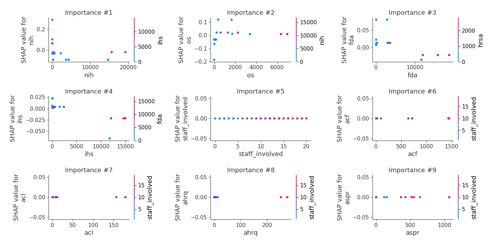

# Summary of 6_Default_RandomForest

[<< Go back](../README.md)

## Random Forest
- **n_jobs**: -1
- **criterion**: gini
- **max_features**: 0.9
- **min_samples_split**: 30
- **max_depth**: 4
- **eval_metric_name**: logloss
- **num_class**: 19
- **explain_level**: 2

## Validation
 - **validation_type**: split
 - **train_ratio**: 0.75
 - **shuffle**: True
 - **stratify**: True

## Optimized metric
logloss

## Training time

17.1 seconds

### Metric details
|           |   0.0 |   0.18 |   0.27 |   0.55 |   32.0 |   75.0 |   80.0 |   115.0 |   137.0 |    337.0 |    643.0 |   1798.0 |   2151.0 |   2303.0 |   2515.0 |   3842.0 |   7693.0 |   11899.0 |   14050.0 |   accuracy |   macro avg |   weighted avg |   logloss |
|:----------|------:|-------:|-------:|-------:|-------:|-------:|-------:|--------:|--------:|---------:|---------:|---------:|---------:|---------:|---------:|---------:|---------:|----------:|----------:|-----------:|------------:|---------------:|----------:|
| precision |     0 |      1 |      0 |      0 |      0 |      0 |      0 |       0 |       1 | 0.333333 | 0.125    | 0.5      |        0 |        1 |        1 |        0 |        0 |  0.5      |         0 |   0.421053 |    0.287281 |       0.287281 |   1.20546 |
| recall    |     0 |      1 |      0 |      0 |      0 |      0 |      0 |       0 |       1 | 1        | 1        | 1        |        0 |        1 |        1 |        0 |        0 |  1        |         0 |   0.421053 |    0.421053 |       0.421053 |   1.20546 |
| f1-score  |     0 |      1 |      0 |      0 |      0 |      0 |      0 |       0 |       1 | 0.5      | 0.222222 | 0.666667 |        0 |        1 |        1 |        0 |        0 |  0.666667 |         0 |   0.421053 |    0.318713 |       0.318713 |   1.20546 |
| support   |     5 |      5 |      5 |      5 |      5 |      5 |      5 |       5 |       5 | 5        | 5        | 5        |        5 |        5 |        5 |        5 |        5 |  5        |         5 |   0.421053 |   95        |      95        |   1.20546 |

## Confusion matrix
|                    |   Predicted as 0.0 |   Predicted as 0.18 |   Predicted as 0.27 |   Predicted as 0.55 |   Predicted as 32.0 |   Predicted as 75.0 |   Predicted as 80.0 |   Predicted as 115.0 |   Predicted as 137.0 |   Predicted as 337.0 |   Predicted as 643.0 |   Predicted as 1798.0 |   Predicted as 2151.0 |   Predicted as 2303.0 |   Predicted as 2515.0 |   Predicted as 3842.0 |   Predicted as 7693.0 |   Predicted as 11899.0 |   Predicted as 14050.0 |
|:-------------------|-------------------:|--------------------:|--------------------:|--------------------:|--------------------:|--------------------:|--------------------:|---------------------:|---------------------:|---------------------:|---------------------:|----------------------:|----------------------:|----------------------:|----------------------:|----------------------:|----------------------:|-----------------------:|-----------------------:|
| Labeled as 0.0     |                  0 |                   0 |                   0 |                   0 |                   0 |                   0 |                   0 |                    0 |                    0 |                    0 |                    5 |                     0 |                     0 |                     0 |                     0 |                     0 |                     0 |                      0 |                      0 |
| Labeled as 0.18    |                  0 |                   5 |                   0 |                   0 |                   0 |                   0 |                   0 |                    0 |                    0 |                    0 |                    0 |                     0 |                     0 |                     0 |                     0 |                     0 |                     0 |                      0 |                      0 |
| Labeled as 0.27    |                  0 |                   0 |                   0 |                   0 |                   0 |                   0 |                   0 |                    0 |                    0 |                    0 |                    5 |                     0 |                     0 |                     0 |                     0 |                     0 |                     0 |                      0 |                      0 |
| Labeled as 0.55    |                  0 |                   0 |                   0 |                   0 |                   0 |                   0 |                   0 |                    0 |                    0 |                    0 |                    5 |                     0 |                     0 |                     0 |                     0 |                     0 |                     0 |                      0 |                      0 |
| Labeled as 32.0    |                  0 |                   0 |                   0 |                   0 |                   0 |                   0 |                   0 |                    0 |                    0 |                    0 |                    5 |                     0 |                     0 |                     0 |                     0 |                     0 |                     0 |                      0 |                      0 |
| Labeled as 75.0    |                  0 |                   0 |                   0 |                   0 |                   0 |                   0 |                   0 |                    0 |                    0 |                    0 |                    0 |                     5 |                     0 |                     0 |                     0 |                     0 |                     0 |                      0 |                      0 |
| Labeled as 80.0    |                  0 |                   0 |                   0 |                   0 |                   0 |                   0 |                   0 |                    0 |                    0 |                    0 |                    5 |                     0 |                     0 |                     0 |                     0 |                     0 |                     0 |                      0 |                      0 |
| Labeled as 115.0   |                  0 |                   0 |                   0 |                   0 |                   0 |                   0 |                   0 |                    0 |                    0 |                    0 |                    5 |                     0 |                     0 |                     0 |                     0 |                     0 |                     0 |                      0 |                      0 |
| Labeled as 137.0   |                  0 |                   0 |                   0 |                   0 |                   0 |                   0 |                   0 |                    0 |                    5 |                    0 |                    0 |                     0 |                     0 |                     0 |                     0 |                     0 |                     0 |                      0 |                      0 |
| Labeled as 337.0   |                  0 |                   0 |                   0 |                   0 |                   0 |                   0 |                   0 |                    0 |                    0 |                    5 |                    0 |                     0 |                     0 |                     0 |                     0 |                     0 |                     0 |                      0 |                      0 |
| Labeled as 643.0   |                  0 |                   0 |                   0 |                   0 |                   0 |                   0 |                   0 |                    0 |                    0 |                    0 |                    5 |                     0 |                     0 |                     0 |                     0 |                     0 |                     0 |                      0 |                      0 |
| Labeled as 1798.0  |                  0 |                   0 |                   0 |                   0 |                   0 |                   0 |                   0 |                    0 |                    0 |                    0 |                    0 |                     5 |                     0 |                     0 |                     0 |                     0 |                     0 |                      0 |                      0 |
| Labeled as 2151.0  |                  0 |                   0 |                   0 |                   0 |                   0 |                   0 |                   0 |                    0 |                    0 |                    0 |                    5 |                     0 |                     0 |                     0 |                     0 |                     0 |                     0 |                      0 |                      0 |
| Labeled as 2303.0  |                  0 |                   0 |                   0 |                   0 |                   0 |                   0 |                   0 |                    0 |                    0 |                    0 |                    0 |                     0 |                     0 |                     5 |                     0 |                     0 |                     0 |                      0 |                      0 |
| Labeled as 2515.0  |                  0 |                   0 |                   0 |                   0 |                   0 |                   0 |                   0 |                    0 |                    0 |                    0 |                    0 |                     0 |                     0 |                     0 |                     5 |                     0 |                     0 |                      0 |                      0 |
| Labeled as 3842.0  |                  0 |                   0 |                   0 |                   0 |                   0 |                   0 |                   0 |                    0 |                    0 |                    5 |                    0 |                     0 |                     0 |                     0 |                     0 |                     0 |                     0 |                      0 |                      0 |
| Labeled as 7693.0  |                  0 |                   0 |                   0 |                   0 |                   0 |                   0 |                   0 |                    0 |                    0 |                    5 |                    0 |                     0 |                     0 |                     0 |                     0 |                     0 |                     0 |                      0 |                      0 |
| Labeled as 11899.0 |                  0 |                   0 |                   0 |                   0 |                   0 |                   0 |                   0 |                    0 |                    0 |                    0 |                    0 |                     0 |                     0 |                     0 |                     0 |                     0 |                     0 |                      5 |                      0 |
| Labeled as 14050.0 |                  0 |                   0 |                   0 |                   0 |                   0 |                   0 |                   0 |                    0 |                    0 |                    0 |                    0 |                     0 |                     0 |                     0 |                     0 |                     0 |                     0 |                      5 |                      0 |

## Learning curves

## Permutation-based Importance

## Confusion Matrix

## Normalized Confusion Matrix

## ROC Curve

## Precision Recall Curve

## SHAP Importance

## SHAP Dependence plots

### Dependence 0.0 (Fold 1)

### Dependence 0.18 (Fold 1)

### Dependence 0.27 (Fold 1)

### Dependence 0.55 (Fold 1)

### Dependence 115.0 (Fold 1)

### Dependence 11899.0 (Fold 1)

### Dependence 137.0 (Fold 1)

### Dependence 14050.0 (Fold 1)

### Dependence 1798.0 (Fold 1)

### Dependence 2151.0 (Fold 1)

### Dependence 2303.0 (Fold 1)

### Dependence 2515.0 (Fold 1)

### Dependence 32.0 (Fold 1)

### Dependence 337.0 (Fold 1)

### Dependence 3842.0 (Fold 1)

### Dependence 643.0 (Fold 1)

### Dependence 75.0 (Fold 1)

### Dependence 7693.0 (Fold 1)

### Dependence 80.0 (Fold 1)

## SHAP Decision plots

### Worst decisions for selected sample 1 (Fold 1)

### Worst decisions for selected sample 2 (Fold 1)

### Worst decisions for selected sample 3 (Fold 1)

### Worst decisions for selected sample 4 (Fold 1)

### Best decisions for selected sample 1 (Fold 1)

### Best decisions for selected sample 2 (Fold 1)

### Best decisions for selected sample 3 (Fold 1)

### Best decisions for selected sample 4 (Fold 1)

[<< Go back](../README.md)
